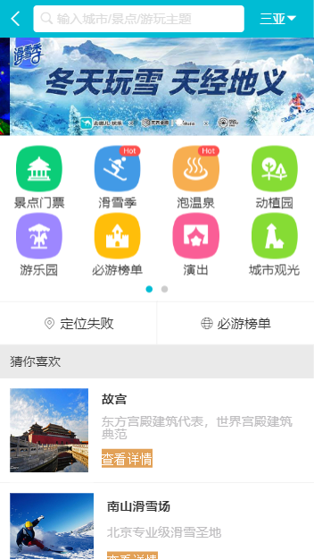
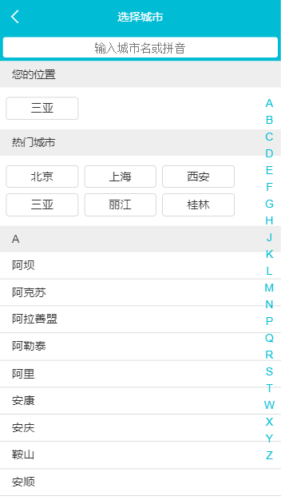
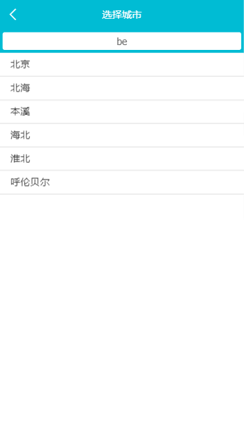
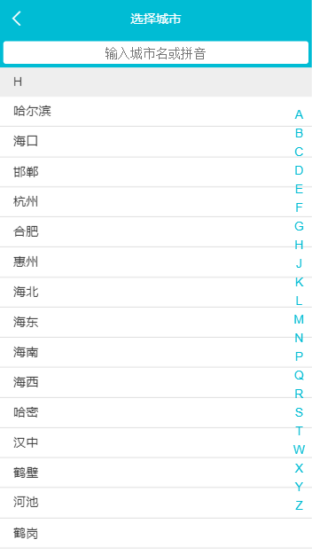
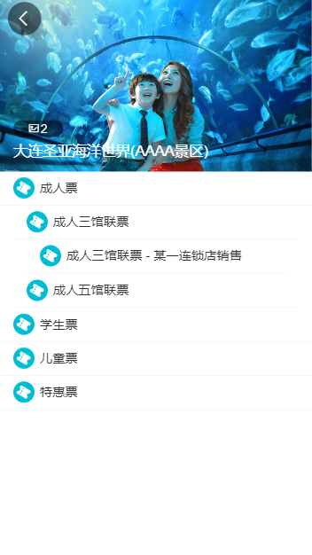
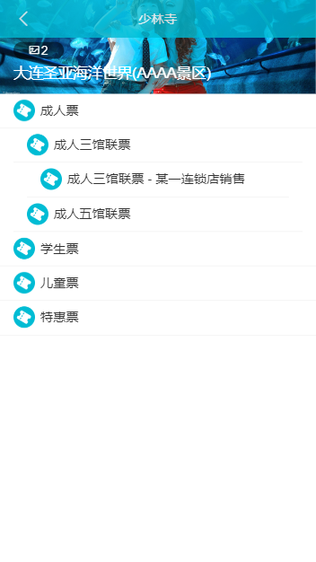

# Vue2.5 开发去哪儿网App
简述：仿移动端去哪儿网，使用mock数据，支持根据不同城市选择不同景点的功能，首页多区域轮播，城市的展示搜索，城市左侧字母与右侧区块动画联动等等

# [项目预览](https://wanggege919.github.io/travel-new/dist/index.html#/)

# 技能树
- 使用语言：vue + vue-cli + axios + vuex + vue-router + stylus + eslint + es6
- 使用 vue-cli 进行原型开发并配置 config
- 使用 vue-router 进行路由管理，与vueJs集成构建单页应用，分模块化配置
- 使用 vuex 进行地址状态管理，支持增删改查
- 使用 axios + promise 异步请求
- 使用 swiper + better-scroll + animate.css 插件
- 使用 stylus 语法：嵌套，混入，函数等

# 图示
- 首页

  
- 城市页
  
  
  
- 景点详情页
  
  
  

# 项目相关博客整理：
[去哪了网项目总结（移动端）](https://www.jianshu.com/p/09e24d1516f5)

